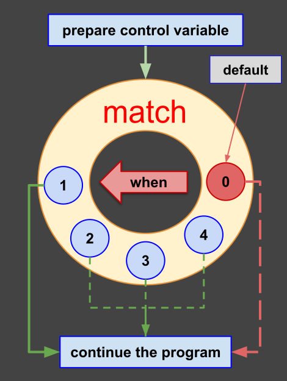
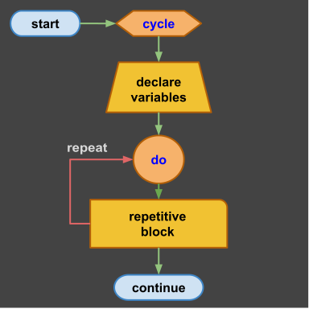
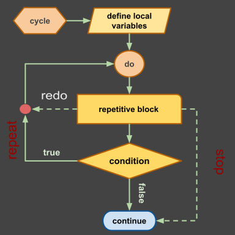
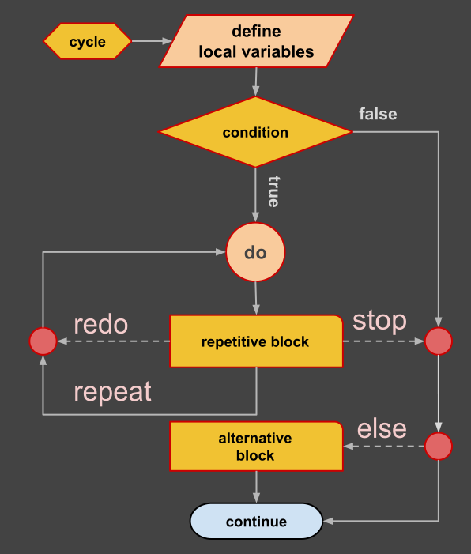
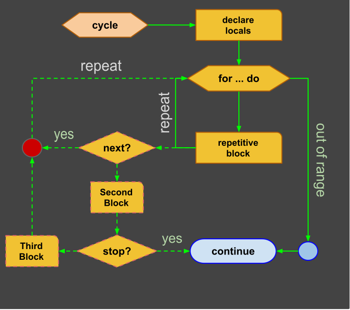
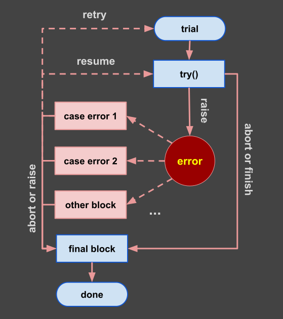

# Bee Specification: Statements & Execution Control (02-statements.md)

## 1. Executive Statement Taxonomy

Bee divides statements into six distinct syntactic categories, designed for high-performance one-pass compilation and human readability:

1. **Declarative Statements:** Allocate variable names and bind static/inferred types (`set`, `new`).
2. **Mutation Statements:** Rebind values, clone memory structures, or apply in-place mathematical updates (`let`, `:=`, `::`, compound operators).
3. **Contract & Verification Statements:** Assert non-fatal warnings and enforce runtime invariants (`assert`, `expect`).
4. **Control Flow Statements:** Direct branching, pattern matching, local scoping, and iteration loops (`if`, `match`, `start`, `with`, `cycle`, `for`).
5. **Transactional Trial Statements:** Error handling, staged execution steps, and recovery (`trial`, `try`, `case`, `miss`, `final`).
5. **Transfer & Termination Statements:** Jump, loop control, and routine completion (`return`, `stop`, `redo`, `next`, `pass`, `yield`, `raise`, `resume`, `retry`).

> **Decision 6 alignment (2026-09-12):** Bee `print` / `write` / `read` directives are themselves `rule_call` invocations; they participate in the canonical *curried rule signature* system defined in `spec/03-rules.md` §2.4 and §3.1. The legacy `using` postfix on `io_stmt` is **deprecated**. The canonical call-site form is `print(a, b)(sep: " | ");` where the `print` rule declares a named-parameter slot `(sep: ", " ∈ Str)` in its signature. Deprecated `using` forms emit non-fatal `E0011` until Phase 7 audit task 7.2 hardens the diagnostic to `E0009`. The full EBNF lives in §5 below.

---

## 2. Declarations, Mutations & Assignment Operators

### 2.1 Variable Declaration & Gradual Typing Initialization
Bee provides two declaration keywords (`set` for constants, `new` for mutable variables) with gradual typing semantics governed by the choice of operator (`:=` for type inference, `:` for structural pair-up):

- **Type Inference (`:=` with `set` / `new`):**
  Defines and initializes variables without explicit type specification. The compiler infers static types from the assigned expression(s).
  $$\text{binding}(x_i) \leftarrow v_i \quad (\text{read-only constant for } set)$$
  $$\text{alloc}(x_i) \in \text{typeof}(v_i), \quad x_i \leftarrow v_i \quad (\text{mutable for } new)$$
  ```bee
  set max_buffer := 1024;
  set width, height := 1920, 1080;
  new name := "Bee";
  new x, y, z := 1, 2, 3;    -- parallel 1-to-1 inferred binding
  ```

- **Explicit Type Declaration & Zero-Initialization (`∈ Type`):**
  Declares single or multiple variables with a static type constraint, automatically zero-initializing each identifier according to its type.
  $$\forall i \in [1, n], \quad \text{alloc}(x_i) \in \mathbb{T}, \quad x_i \leftarrow \text{zero}(\mathbb{T})$$
  ```bee
  new count ∈ Z;             -- single variable zero-initialized to 0
  new a, b, c ∈ Z;           -- multiple variables all initialized to 0
  ```

- **Explicit Type Initialization (`= with ∈ Type`):**
  The `=` operator assigns an initial value while mandating explicit type specification $Type$.
  $$\forall i \in [1, n], \quad \text{alloc}(x_i) \in \mathbb{T}, \quad x_i \leftarrow v_0$$
  ```bee
  new count ∈ Z = 0;
  new xo, yo, zo ∈ Z = 10;   -- type Z explicitly specified; broadcast initialization
  ```
- **Equality & Relation Operators (mirror of `spec/01-lexical-structure.md` §3.3, Decisions 2-3):**
  - **Value Comparison (`=`, `¬`)**: `=` evaluates structural equality of two values (true across distinct allocations). `¬` is canonical value inequality — the Unicode form `≠` is deprecated (Decision 12) and will be hard-rejected (E0009) once Phase 7 audit task 7.2 completes; the lexer currently emits non-fatal E0010.
  - **Identity Check (`is`, `is not`)**: Evaluates reference/pointer identity (or negation). `a is b` returns false across distinct allocations even when `a = b`. The reference-of operator `@` provides an equivalent formulation: `@a = @b` is true iff `a` and `b` share the same allocation; `@a ¬ @b` is true iff they differ.
  - **Range Notation (`..`, `..<`, `>..`, `>..<`)**: Denotes range boundaries (Decision 13, 2026-09-13). The four endpoint-inclusion operators are: `..` (closed `[a,b]`), `..<` (right-exclusive `[a,b)`), `>..` (left-exclusive `(a,b]`), `>..<` (fully exclusive `(a,b)`). A postfix positional application `(min..max)(step)` (or any of the four range-op variants) discretises the range into a stepped sequence indexable 1-based.
  ```bee
  expect count = 0;          -- value equality
  expect count ¬ 1;          -- canonical inequality (Unicode ≠ rejected)
  expect xo is yo;            -- identity
  expect xo is not zo;        -- identity negation
  expect @xo = @yo;           -- reference identity (equivalent to "is")
  expect @xo ¬ @zo;           -- reference inequality
  new r ∈ N := (1..10);       -- closed inclusive range [1, 10] (Decision 13)
  new s ∈ N := (1..<10);      -- right-exclusive range [1, 10) (Decision 13)
  new t ∈ N := (1>..10);     -- left-exclusive range (1, 10] (Decision 13)
  ```

- **Logical Operators:**
Bee utilizes descriptive keywords for boolean logic: `and`, `or`, `xor`, `not`.
```bee
if (a = 0) and (not (b = 0)) do ...
```

### 2.2 Mutation Semantics (`let`)
- **Operator `:=` Evaluation:** Modifies an existing variable declared with `new`. Fails with `E0202: UnboundVariable` if the target was not previously initialized.
- **Mathematical Compound Operators:**
  $$x \leftarrow x \oplus e, \quad \oplus \in \{ +, -, \times, \div, \%, \wedge, \sqrt{} \}$$
  ```bee
  let x += 5;   -- Addition
  let x *= 2;   -- Multiplication
  let x ^= 3;   -- Exponentiation (x = x³)
  let x √= 2;   -- Square root (x = √x)
  ```
- **Deep Clone Assignment (`::`):**
  $$x \mathrel{::} y \implies \text{clone}_{\text{deep}}(y)$$
  Performs an isolated deep copy of composite structures, creating an independent memory allocation.
  ```bee
  let copy_list :: original_list;
  ```

### 2.3 Memory Directives
- **Explicit Invalidation (`zap`):** `zap identifier;` invalidates the target identifier in Hot Zone performance paths, forcing immediate reclamation within the active region.

### 2.4 Contract & Verification Statements (`assert`, `expect`)
- **Warning Assertion (`assert`):**
  $$\text{eval}(c) = 0 \implies \text{warn}(\text{stderr}, \text{line})$$
  Evaluates condition $c$. If false ($0$ or `false`), outputs a diagnostic warning to `stderr` and continues execution.
  ```bee
  assert denominator ¬ 0;    -- canonical form per Decision 12 (≠ emits E0010)
  ```
- **Invariant Expectation (`expect`):**
  $$\text{eval}(c) = 0 \implies \text{raise}(\text{ExpectationFailed})$$
  Evaluates condition $c$. If false ($0$ or `false`), raises a runtime error that halts execution with status $1$ unless handled by `trial`.
  ```bee
  expect result * denominator ≈ numerator;
  ```

---

## 3. Control Flow Mechanics

### 3.1 Scope Blocks (`start`, `with`)

#### Local Scope (`start`)
Encapsulates variables within an isolated stack frame to optimize region lifetime:
```bee
start worker_scope:
  new temp := 10;
do
  print ("Temp value:", temp);
done worker_scope;
```

#### Qualifier Suppression (`with`)
Suppresses module or object prefixes in an anonymous local block:
```bee
with math_module do
  print sin(angle) + cos(angle);
done;
```

---

### 3.2 Conditional Execution (`if / else`)

Branch execution is controlled by a logical condition using `do` and closed by `done;`.

#### Simple Conditional Fork
```bee
if a < 0 do
  print ("|a| =", -a);
done;
```

#### Two-Way Decision Fork
```bee
if x > 0 do
  print "positive";
else
  print "non-positive";
done;
```

#### Decision Ladder (`else if`)
$$\text{branch} = \begin{cases} B_1 & \text{if } c_1 \\ B_2 & \text{else if } c_2 \\ B_{\text{default}} & \text{else} \end{cases}$$

```bee
if a = 0 do
  print "a = 0";
else if a > 0 do
  print "a > 0";
else if a < 0 do
  print "a < 0";
else
  print "unexpected state";
done;
```

#### Conditional Expression Selector (Ternary)
```bee
new value := (expr_true if condition else expr_false);
```

---

### 3.3 Pattern & Value Matching (`match`)

Multi-path enumerable symbol selector based on jump tables. Supports `one` (first match) and `all` (evaluate all matching branches).



```bee
match select one:
when 1 do
  print "case one";
when 2, 3 do
  print "case two or three";
when (4..10) do
  print "in range four to ten";
other
  print "default fallback";
done;
```

---

### 3.4 Repetitive Loop Statements (`cycle`, `while`, `for`)

All iterative loops are closed by **`repeat [label] [if condition];`**.

#### 1. Infinite & Stop-Condition Cycle



```bee
cycle loop_label:
  new count := 0;
do
  let count += 1;
  stop loop_label if count ≥ 100;
  write count;
repeat loop_label;
```

#### 2. While Cycle (`while ... do`)


```bee
cycle:
  new n := 0;
while n < 10 do
  let n += 1;
  write n;
then
  print "Loop completed cleanly.";
repeat;
```

#### 3. Domain & Collection For Cycle (`for ... do`)
$$\forall i \in (\text{min} \dots \text{max} : \text{rate})$$



```bee
cycle:
  new i ∈ N;
for ∀ i ∈ (1..9)(2) do
  write i;
  next if i = 5;
repeat;
```

---

## 4. Transactional Error Handling (`trial`)

The `trial` statement provides staged process execution with step-by-step recovery, pattern-matching handlers, and guaranteed finalization.



```bee
trial transaction:
  -- Stage 1: Setup & Precondition
  expect balance ≥ amount;

try step1:
  -- Attempt primary step; skip to next on success
  pass if process_primary();
  fail {code: 101, message: "Primary pipeline failed"} if check_failed;

try step2:
  -- Secondary step
  pass if process_secondary();
  raise {code: 500, message: "Critical failure"} if fatal_condition;

case $error.code = 101 do
  -- Recover from code 101 and continue with next try
  resume;

case $error.code ∈ (200..299) do
  -- Retry entire trial from the beginning
  retry;

miss
  -- Fallback handler for unhandled errors
  raise;

final
  -- Unconditionally executed cleanup
  close_resources();
done transaction;
```

---

## 5. Formal EBNF Statement Grammar

```ebnf
(* Statements *)
statement         ::= decl_stmt
                    | mutation_stmt
                    | memory_stmt
                    | contract_stmt
                    | io_stmt
                    | control_stmt
                    | trial_stmt
                    | transfer_stmt ";" ;

(* Declarations & Mutations *)
decl_stmt         ::= "set" ident_list ":=" expr_list
                    | "new" ident_list ( "∈" | "in" ) type_specifier [ "=" ( expression | expr_list ) | ":=" expr_list ]
                    | "new" ident_list ":=" expr_list ;
ident_list        ::= identifier ( "," identifier )* ;
expr_list         ::= expression ( "," expression )* ;

mutation_stmt     ::= "let" identifier ( assign_op | mutate_op_sugar ) expression ;
assign_op         ::= ":=" | "::" | "*=" | "/=" | "%=" | "^=" | "√=" ;
mutate_op_sugar   ::= "+=" | "-=" ;    (* Decision 2, 2026-09-12: lex-level alias for "+:=" / "-:="; canonical home is spec/01-lexical-structure.md §5 *)
memory_stmt       ::= "zap" identifier ;

(* Contracts & Diagnostics *)
contract_stmt     ::= "assert" expression
                    | "expect" expression [ "else" expression ] ;

(* Expressions (Comparison Operators — canonical home: spec/01-lexical-structure.md §3.3) *)
comparison_expr   ::= expression ( "=" | "¬" | "is" | "is not" | "<" | ">" | "<=" | ">=" | "≈" ) expression ;

(* Logical Operators — Decision 7 keyword/Unicode synonymy (canonical home: spec/01-lexical-structure.md §3.6) *)
logical_expr      ::= expression ( "and" | "or" | "xor" | "not" ) expression
                    | expression ( "∧" | "∨" | "⊕" | "!" ) expression ;

(* Range Notation — Decision 13 (2026-09-13)
   The four endpoint-inclusion operators are lexed as single tokens
   per spec/01-lexical-structure.md §2.1 and §5 (range_op).
   The step postfix is a curried positional application mirrored
   after Decision 6 (named-argument postfix). *)
range_expr        ::= expression range_op expression ;
range_op          ::= ".." | "..<" | ">.." | ">..<" ;
domain_expr       ::= range_expr "(" step_expr ")" ;
step_expr         ::= expression ;

(* I/O Directives (Decision 6 — curried named-argument postfix) *)
io_stmt           ::= "print" [ "(" expression_list ")" | expression_list ] [ "(" [ named_arg_list ] ")" ]
                    | "write" [ "(" expression ")" | expression ] [ "(" [ named_arg_list ] ")" ]
                    | "read" "(" [ expression "," ] identifier ")" [ "(" [ named_arg_list ] ")" ] ;

(* Decision 6 (2026-09-12): io_stmt is a thin wrapper over rule_call.
   The optional trailing parenthesised list is the canonical curried application
   of the directive's named-parameter slot (see spec/03-rules.md §2.4 / §3.1).
   The legacy postfix `"using" [ ":" ] expression` is deprecated; the lexer
   emits non-fatal E0011 'DeprecatedSymbol using' until Phase 7.2 hardens it
   to E0009. *)
named_arg_list    ::= named_argument ( "," named_argument )* ;
named_argument    ::= identifier ":" expression ;
(* named_arguments are order-independent; positional entries are not
   permitted in the named slot — see spec/03-rules.md §3.1. *)

(* Control Flow Blocks *)
control_stmt      ::= if_stmt
                    | match_stmt
                    | scope_stmt
                    | cycle_stmt ;

if_stmt           ::= "if" expression "do" block ( "else" "if" expression "do" block )* [ "else" block ] "done" ;

match_stmt        ::= "match" expression [ "all" | "one" ] ":" [ block ] ( "when" match_targets "do" block )+ [ "other" block ] "done" ;
match_targets     ::= expression ( "," expression )* ;

scope_stmt        ::= "start" [ label ] ":" [ block ] "do" block "done" [ label ]
                    | "with" expression "do" block "done" ;

cycle_stmt        ::= "cycle" [ label ] ":" [ block ] ( "do" | "while" expression "do" | "for" [ "∀" ] identifier ( "∈" | "in" ) expression "do" ) block [ "then" block ] "repeat" [ label ] [ "if" expression ]
                    | "for" [ "∀" ] identifier ( "∈" | "in" ) expression "do" block "repeat" ;

(* Transactional Error Handling *)
trial_stmt        ::= "trial" [ label ] ":" block ( "try" [ label ] ":" block )* ( "case" expression "do" block )* [ "miss" block ] [ "final" block ] "done" [ label ] ;

(* Transfers & Postfix Guards *)
transfer_stmt     ::= ( "return" [ expression_list ]
                      | "stop" [ label ]
                      | "redo" [ label ]
                      | "next" [ label ]
                      | "pass"
                      | "raise" [ expression ]
                      | "resume"
                      | "retry"
                      | "fail" expression ) [ "if" expression ] ;
```

---

## 6. Block Indentation & Alignment Rules

1. **Mandatory 2-Space Indentation:** Statements inside any block body MUST be indented by exactly 2 spaces relative to the enclosing block header.
2. **Symmetric Block Terminators:**
   - **`done [label];`** terminates `if`, `match`, `start`, `with`, and `trial` blocks.
   - **`repeat [label];`** terminates `cycle` and `for` loops.
   - **`return;`** terminates `rule` subroutines.
3. **Alignment Invariant:** Terminator keywords align horizontally with their opening block header (0 relative indentation).

---

## 7. Diagnostic Error Codes

| Error Code | Violation | Description |
| :--- | :--- | :--- |
| `E0201` | `IndentationMismatch` | Statement is not aligned to 2-space offset boundary |
| `E0202` | `UnboundVariable` | Attempt to mutate variable without prior `new` declaration |
| `E0203` | `UnterminatedBlock` | Missing `done`, `repeat`, or `return` terminator |
| `E0204` | `InvalidCloneOperation` | Using `::` clone operator on non-clonable primitive |
| `E0205` | `LabelMismatch` | Closing label on `repeat` or `done` does not match opening header label |
| `W0301` | `AssertionWarning` | Assertion failed in `assert` statement (non-fatal warning logged to stderr) |
| `E0303` | `ExpectationFailed` | Invariant failed in `expect` statement (fatal runtime error if unhandled) |
| `E0307` | `MissingNamedArgument` | Curried call site omits a required named-parameter slot binding with no default (Decision 6; canonical home `spec/03-rules.md` §7) |
| `W0308` | `NamedSlotIgnored` | Curried `(...)` argument list appended where the directive / rule declares no named slot (silently tolerated, warning emitted; Decision 6) |
| `E0309` | `UnknownNamedArgument` | Curried call site names an identifier not present in the rule's declared named slot (Decision 6) |
| `E0011` | `DeprecatedSymbol 'using'` | Legacy `using` / `using:` postfix encountered on `io_stmt`; canonical is curried named-argument `(name: ...)` per Decision 6 (Phase 7 audit pre-`E0009`) |

---

## 8. Decision 6 Alignment Status

- **Harmonization complete (this pass).** §5 `io_stmt` EBNF now mirrors `spec/03-rules.md` §2.4 / §3.1 — the `print`, `write`, and `read` directives accept the same curried `(named_arg_list)` postfix as ordinary `rule_call` invocations. The legacy `"using" [ ":" ] expression` postfix is deprecated.
- **Canonical call-site form:** `print(a, b)(sep: " | ");` — the `sep` name is bound by the `print` rule's declared `(sep: ", " ∈ Str)` named-parameter slot (see `spec/03-rules.md` §2.4).
- **Deprecation surface.** Encountering a `using` postfix on `io_stmt` lexes successfully but emits non-fatal `E0011 DeprecatedSymbol 'using'`; Phase 7 audit task 7.2 hardens this to a hard `E0009` syntax error.
- **Procedural note.** Stage 0 source programs (e.g. `test/level0/T0001.bee`, `T0002.bee`) that still employ the legacy `using:` postfix are migrated to the curried form as part of the Decision 6 harmonization pass; the migration is permitted because the change is spec-driven and well-documented in §3.1 of `spec/03-rules.md`.
- **Next gate.** Implementation in `internal/lexer/`, `internal/parser/`, and the print/write/read evaluators is unlocked once `spec/01-lexical-structure.md`, `spec/02-statements.md`, and `spec/03-rules.md` are all harmonized with Decision 6. As of this pass, all three specs are consistent. The pre-implementation parser hazard remains tracked in `issues/14-parser-silent-token-drop.md`.
