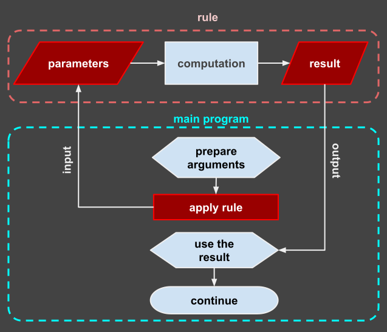
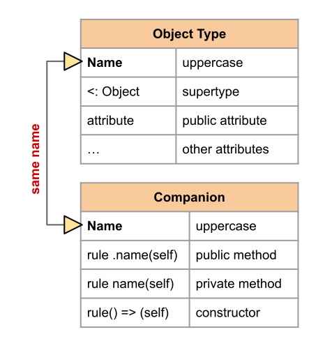
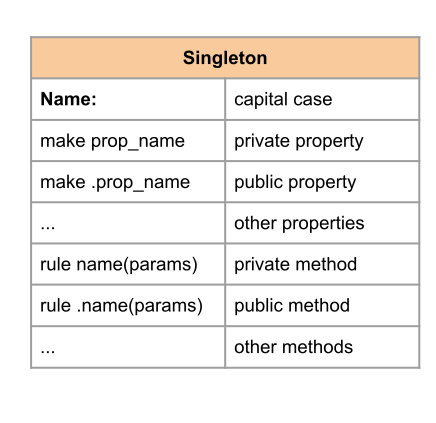

# Bee Specification: Rules & Subroutines (03-rules.md)

## 1. Architectural Philosophy & Purpose

In Bee, all subroutines, procedures, functions, constructors, and methods are unified under a single foundational primitive: the **`rule`**.

$$\text{Rule}: \quad (\mathbb{P}_1 \times \mathbb{P}_2 \times \dots \times \mathbb{P}_n) \longrightarrow (\mathbb{R}_1 \times \mathbb{R}_2 \times \dots \times \mathbb{R}_m)$$

- **Unified Primitive:** A `rule` acts as a pure mathematical function when stateless, a procedure when side-effecting, a constructor when initializing state, or an object method when attached to a closure frame.
- **Main Entry Orchestrator:** Every executable Bee main module MUST define a top-level `rule main:` which serves as the application entry point.
- **Explicit Result Naming:** Rules explicitly declare parameter names and result variable names in their signature, providing self-documenting signatures and zero-overhead result initialization.



---

## 2. Rule Anatomy & Signature Layout

### 2.1 Complete Signature Syntax
```bee
rule identifier(param_list) => (result_list):
  -- Preconditions (Contracts)
  assert condition;
  
  -- Body statements (indented 2 spaces)
  
  -- Postconditions / Invariants (Contracts)
  expect condition;
return;
```

### 2.2 Parameter Passing Conventions
- **Primitive Types ($\mathbb{Z}, \mathbb{N}, \mathbb{R}, \mathbb{Q}, \mathbb{C}, \mathbb{B}$):** Transferred **by value** (copy on call).
- **Composite Types (`array`, `list`, `map`, `set`, `object`):** Transferred **by share** (reference-counted Region pointer).
- **Optional Parameters:** Parameter declarations may specify default values using `:` (e.g. `param: default_val ∈ Type`).
- **Variadic Parameters (`*varargs`):** The final parameter in a list may be prefixed with `*` to accept a variable number of arguments as an array (`*args ∈ [Z]`).

### 2.3 Result Declarations & Deconstruction
- **Named Results:** Results are explicitly declared with identifier and type `=> (y ∈ N)` or `=> (s, d ∈ Z)`.
- **Default Result Initialization:** Result variables are automatically initialized to their zero-values upon entering the rule body.
- **Single Capture:** `new r := compute(x);`
- **Multi-Result Deconstruction:**
  $$(s, d) \leftarrow \text{compute\_both}(x, y)$$
  ```bee
  new s, d := compute_both(x, y);
  ```
- **Result Wildcard (`_`):** Unwanted results can be suppressed using `_` (e.g. `new s, _ := compute_both(x, y);`).
- **Expression Restriction:** Rules returning multiple results ($> 1$) CANNOT be embedded directly within nested arithmetic expression trees; they must be evaluated via deconstruction assignment.

---

## 3. Invocations & Early Termination

### 3.1 Invocation Syntax
- **Direct Assignment / Expression Call:** Captures return values into variables.
  ```bee
  new result := fib(n: 5);
  ```
- **Apply Directive (`apply`):** Executes a rule for side-effects, ignoring any returned results.
  ```bee
  apply log_message("Processing complete");
  ```

### 3.2 Terminal Directives
- **`return` (Mandatory Block Terminator):** Closes the rule block and returns execution to the caller. Must align horizontally with the `rule` header (0 relative indentation).
- **`exit` (Early Successful Return):** Instantly terminates rule execution cleanly, returning current values of result variables without raising an error:
  ```bee
  if count = 0 do
    let result := 0;
    exit;
  done;
  ```

---

## 4. Design by Contract (`assert` / `expect`)

Bee enforces formal contract assertions directly within rule definitions:

$$\text{Contract}(\text{divide}) = \begin{cases} \text{assert}(b \neq 0) & \text{[Precondition Warning]} \\ \text{expect}(\text{ratio} \times b \approx a) & \text{[Invariant Guarantee]} \end{cases}$$

```bee
rule divide(a ∈ R, b ∈ R) => (ratio ∈ R):
  assert b ≠ 0;         -- Precondition / Warning check: emits diagnostic warning to stderr if false
  let ratio := a / b;
  expect ratio * b ≈ a; -- Postcondition / Invariant check: raises runtime error if false
return;
```

- **Assertion Warning (`assert`):** Evaluates a condition. If it fails ($0$ or `false`), a diagnostic warning (`W0301: AssertionWarning`) is printed to standard error (`stderr`), but program execution continues uninterrupted.
- **Expectation Enforcement (`expect`):** Evaluates an invariant condition. If it fails ($0$ or `false`), a runtime error (`E0303: ExpectationFailed`) is raised and propagated up the call stack. If not caught by an enclosing `trial` block, the application halts immediately with a failure exit status.

---

## 5. Advanced Rule Architectures

### 5.1 Companion & Singleton Rules



- **Companion Rule:** Binds state and helper logic to an existing module or data type.
- **Singleton Rule:** Encapsulates globally isolated state within a single instance generator.

### 5.2 Forward Declarations (No Hoisting)
Bee does NOT use compiler hoisting. Identifiers must be declared before use. For mutual or cyclic rule dependencies, explicit forward declarations (signature ending with `;`) MUST be provided:

```bee
-- Forward declaration signature
rule even(n ∈ N) => (b ∈ B);
rule odd(n ∈ N) => (b ∈ B);

-- Implementation
rule even(n ∈ N) => (b ∈ B):
  if n = 0 do
    let b := true;
    exit;
  done;
  let b := odd(n - 1);
return;

rule odd(n ∈ N) => (b ∈ B):
  if n = 0 do
    let b := false;
    exit;
  done;
  let b := even(n - 1);
return;
```

### 5.3 Tail Call Optimization (TCO)
A rule invocation in final return position (`let r := tail_rule(...)` followed immediately by `return`) is optimized by the compiler via Tail Call Optimization:

$$T(n) = \mathcal{O}(1) \text{ Stack Frames}$$

- Overwrites the caller's Region Arena stack frame instead of pushing a new frame.
- Re-executes rule body with updated argument values, converting recursion into iteration with $O(1)$ stack space.

### 5.4 Closures & State Generators
Rules can encapsulate persistent state and nested method rules (`closures`). 

- **State Mutability**: Variables stored in the rule closure must be explicitly boxed using the **`[]`** operator (e.g., `set .count := [start];`) to be heap-allocated and mutable. Unboxed variables defined via `set` within a rule are immutable.

```bee
rule counter_generator(start ∈ Z) => (next ∈ Rule):
  set .count := [start];  -- Boxed for mutability
  
  rule .next() => (val ∈ Z):
    let .count += 1;      -- Mutation allowed due to boxing
    let val := .count;
  return;
return;
```

---

## 6. Formal EBNF Grammar

```ebnf
(* Rule Definition *)
rule_def          ::= "rule" [ member_access ] identifier "(" [ param_list ] ")" [ "=>" "(" result_list ")" ] ":" [ contract_clause ] block "return" ";" ;
forward_decl      ::= "rule" identifier "(" [ param_list ] ")" [ "=>" "(" result_list ")" ] ";" ;

(* Parameters & Results *)
param_list        ::= parameter ( "," parameter )* ;
parameter         ::= [ "*" ] identifier [ ":" expression ] ( "∈" | "in" ) type_specifier ;

result_list       ::= result_item ( "," result_item )* ;
result_item       ::= identifier [ ":" expression ] [ ( "∈" | "in" ) type_specifier ] ;

(* Contracts *)
contract_clause   ::= ( "assert" condition ";" )* ( "expect" condition ";" )* ;

(* Invocations *)
rule_apply        ::= "apply" identifier "(" [ arg_list ] ")" ";" ;
rule_call         ::= identifier "(" [ arg_list ] ")" ;
arg_list          ::= argument ( "," argument )* ;
argument          ::= [ identifier ":" ] expression ;
```

---

## 7. Diagnostic Codes

| Error Code | Error Condition | Description |
| :--- | :--- | :--- |
| `E0301` | `UndeclaredRule` | Rule invoked prior to definition or forward declaration |
| `W0301` | `AssertionWarning` | Assertion failed in `assert` contract clause (warning emitted to stderr) |
| `E0303` | `ExpectationFailed` | Expectation failed in `expect` contract clause or body statement (fatal runtime error if unhandled) |
| `E0304` | `MultiResultInExpression` | Multi-result rule used inside arithmetic expression tree |
| `E0305` | `MissingReturnTerminator` | Rule block does not end with aligned `return;` |
| `E0306` | `SignatureMismatch` | Forward declaration does not match rule implementation signature |

---

## 8. Alignment Status

- **Issues Addressed:** Formalized rule semantics, contracts, TCO, closures, and forward declarations.
- **Manifest Tracking:** Updated `MANIFEST.md` to reflect completion of `spec/03-rules.md`.
