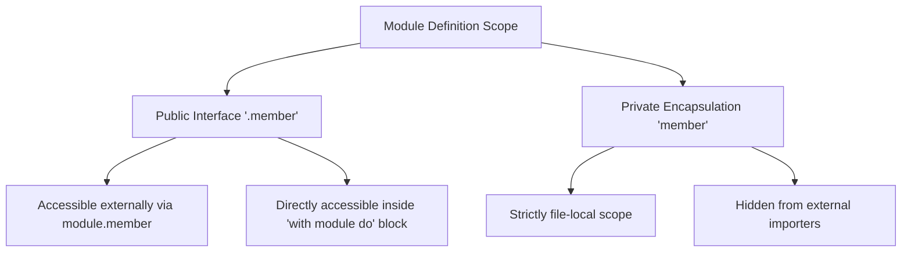

# Bee Specification: Module Architecture & Program Structure (04-structure.md)

## 1. Executive Program Architecture

A Bee application is engineered as a directed dependency graph of isolated, single-responsibility **modules**. Each module resides in its own `.bee` source file and defines an encapsulated lexical namespace.

```text
$pro_home/             # Project Root Directory
├── bin/               # Compiled binary executables
├── src/               # Application secondary modules
│   ├── math_utils.bee # Secondary module (src/math_utils.bee)
│   └── data_store.bee # Secondary module (src/data_store.bee)
├── lib/               # Project-local library modules
│   └── logger.bee     # Library module (lib/logger.bee)
├── spec/              # Formal language specifications & diagrams
│   └── img/           # Architectural SVG & PNG diagrams
├── main.bee           # Main module application entry point
└── config.json        # Environment configuration
```

---

## 2. Module Classification & Roles

$$\text{Program} = \mathcal{M}_{\text{main}} \cup \left( \bigcup_{i=1}^n \mathcal{M}_{\text{src}, i} \right) \cup \left( \bigcup_{j=1}^m \mathcal{M}_{\text{lib}, j} \right)$$

### 2.1 Main Module (`main.bee`)
- **Role:** Application orchestrator and top-level entry point.
- **Invariants:**
  1. MUST contain exactly one top-level `rule main:` entry point:
     ```bee
     rule main(*params ∈ S) => (code ∈ Z):
       print "Application initialized.";
     return;
     ```
  2. MUST NOT be imported by secondary or library modules.
  3. Holds global system configuration directives and top-level defaults.

### 2.2 Secondary Modules (`src/*.bee`)
- **Role:** Project-specific domain logic, algorithms, and business services.
- **Invariants:**
  1. MUST NOT contain `rule main`.
  2. Loaded via the import directive: `use module_name;` or `use path/module_name as alias_name;`.
  3. Exported public members are accessible via qualifier dot notation (`module_name.member`).

### 2.3 Library Modules (`lib/*.bee`)
- **Role:** Reusable, standalone components distributed across projects.
- **Invariants:**
  1. Self-contained and strictly decoupled from application domain state.
  2. Managed as immutable singletons upon first initialization.

### 2.4 Module Lifecycle & Singleton Persistence
- **Zero Dynamic Unload:** All modules are loaded into the Region Arena as persistent singletons upon first encounter of a `use` directive.
- **Thread Safety:** Module global constants (`set .name := val;`) are immutable and shared across threads without locking. Module mutable states are guarded by atomic reference counting or isolated thread frames.

---

## 3. System Variables & Sigil Namespaces (`$`)

System paths, runtime configurations, and diagnostic limits are protected under the **`$`** sigil:

$$\mathbb{V}_{\text{system}} = \{ \$id \mid id \in \text{Identifier} \}$$

| Sigil Identifier | Description | Default Resolution |
| :--- | :--- | :--- |
| `$bee_home` | Bee compiler runtime installation directory | OS System Installation Path |
| `$bee_lib` | Global system library root directory | `$bee_home/lib/` |
| `$pro_home` | Current application project root directory | Location of `main.bee` |
| `$pro_lib` | Project-local library directory | `$pro_home/lib/` |
| `$pro_mod` | Secondary module search path list | `$pro_home/src/` |
| `$pro_log` | Diagnostic and execution log folder | `$pro_home/log/` |
| `$max_iterations` | Infinite cycle safety break threshold | `1000000` |
| `$max_precision` | Rational comparison epsilon ($\epsilon$) | `0.00001` |

---

## 4. Name Space, Visibility & Encapsulation



### 4.1 Export Prefix (`.`)
- **Public Members (`.` Prefix):** Exported and visible outside the module boundary.
  ```bee
  #module math_utils

  set .pi := 3.14159265; -- Public constant

  rule .add(a, b ∈ R) => (r ∈ R):
    let r := a + b;
  return;
  ```
- **Private Members (No Prefix):** Hidden and strictly private to the module source file.
  ```bee
  new cache ∈ [R]; -- Private module variable

  rule internal_calc(x ∈ R) => (r ∈ R):
    let r := x * 2;
  return;
  ```

### 4.2 Qualifier Suppression (`with`) & Aliasing (`alias`)
- **Qualifier Suppression (`with`):** Eliminates verbose prefixes inside a dedicated local scope block:
  ```bee
  use src/math_utils as math;

  rule main:
    with math do
      print add(10, 20); -- Invokes math.add
    done;
  return;
  ```
- **Symbol Aliasing (`alias`):** Maps a qualified member to a short local identifier:
  ```bee
  alias sum: math.add;

  rule main:
    print sum(10, 20);
  return;
  ```

---

## 5. Execution Primitives & Scope Boundaries

Bee separates execution modes into three distinct primitives:

1. **Synchronous Invocation (`apply` / Direct Call):**
   - Inline execution on the current thread frame.
   - `apply module.action(args);` executes for side-effects, discarding return values.

2. **Asynchronous Spawning (`begin`):**
   - `begin module.task(args);` spawns a concurrent worker with an isolated region frame.

3. **Barrier Synchronization (`wait`):**
   - `wait;` halts the parent thread until all spawned child workers complete.

---

## 6. Formal EBNF Grammar

```ebnf
(* Module Header & Directives *)
module_file       ::= [ module_header ] ( import_stmt | directive_stmt )* ( member_decl )* ;
module_header     ::= ( "#module" | "#define" ) identifier ;

import_stmt       ::= "use" module_path [ "as" identifier ] ";" ;
module_path       ::= [ "$" identifier "/" ] identifier ( "/" identifier )* ;
directive_stmt    ::= "$" identifier ":=" expression ";" ;

(* Member Visibility & Declarations *)
member_decl       ::= [ "." ] ( decl_stmt | rule_def | object_def | type_def ) ;
alias_stmt        ::= "alias" identifier ":" module_path "." identifier ";" ;

(* Scoped Blocks & Directives *)
with_stmt         ::= "with" expression "do" block "done" ;
sync_execution    ::= "apply" expression "(" [ arg_list ] ")" ";" ;
async_execution   ::= "begin" expression "(" [ arg_list ] ")" ";" ;
wait_barrier      ::= "wait" ";" ;
```

---

## 7. Diagnostic Error Codes

| Error Code | Violation | Description |
| :--- | :--- | :--- |
| `E0401` | `MainModuleRedefinition` | Secondary or library module contains `rule main` |
| `E0402` | `PrivateMemberAccess` | Attempt to access unexported member (missing `.` prefix) |
| `E0403` | `ModuleNotFound` | Module file missing from search path (`$pro_mod`, `$pro_lib`, `$bee_lib`) |
| `E0404` | `CyclicImportError` | Circular dependency detected between imported modules |
| `E0405` | `MainImportForbidden` | Attempt to load `main.bee` via `use` directive |
| `E0406` | `UnsynchronizedWorker` | Scope exited with pending `begin` threads prior to `wait` barrier |

---

## 8. Alignment Status

- **Issues Addressed:** Formalized module namespaces, singleton lifecycle persistence, member visibility (`.`), and clean `with ... do ... done;` scope syntax.
- **Manifest Tracking:** Updated `MANIFEST.md` to reflect completion of `spec/04-structure.md`.
