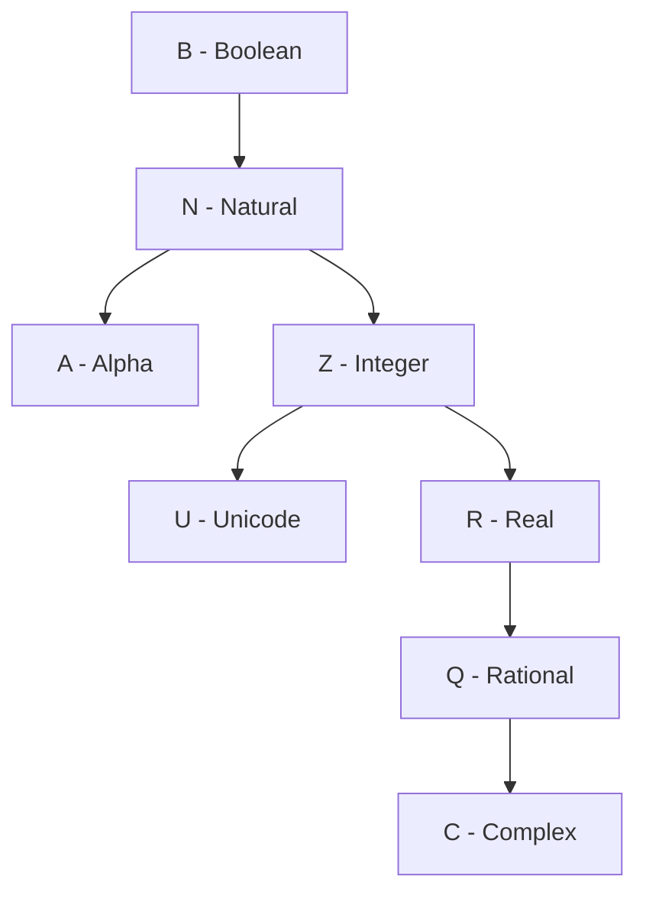

# Bee Specification: Type System Architecture (05-types.md)

## 1. Type Inference & Gradual Typing

Bee employs a gradual typing system where types are resolved at compile time through deterministic inference.

$$\mathbb{T} = \mathbb{T}_{\text{prim}} \cup \mathbb{T}_{\text{comp}} \cup \mathbb{T}_{\text{sub}} \cup \mathbb{T}_{\text{variant}}$$

### 1.1 First-Assignment Invariant
- **Binding Rule**: When a variable is declared without an explicit type (e.g., `new x := expression;`), the compiler binds the variable's type to the evaluated static type of the initial assignment within the current lexical scope.
- **Inference Propagation**: The inferred type is propagated back to the declaration site, ensuring static type safety for all subsequent usages.

### 1.2 Variant Promotion (Divergent Paths)
When a variable is assigned different types across divergent control flow paths (e.g., `if-else` blocks), the compiler promotes the variable to a **Variant Type** (Union Type):

$$\tau_{\text{var}} = \tau_1 \cup \tau_2 \cup \dots \cup \tau_k$$

- **Promotion Rule**: If branch A assigns $\mathbb{Z}$ (Integer) and branch B assigns $\mathbb{R}$ (Real), the variable's final type is promoted to $\mathbb{Z} \mid \mathbb{R}$ (`Variant`).
- **Usage Invariant**: Accessing a Variant-typed variable requires a type guard (`entity.type()` introspection or `match` statement) to resolve the underlying type before executing path-specific operations.
- **Universal Entity Model:** Every value in Bee is an **`Entity`** exposing the `.type()` method (e.g. `10.type()`, `"hello".type()`).

---

## 2. Primitive & Built-In Type Catalogue

Single uppercase Latin letters are strictly reserved for primitive mathematical data types:

| Type Symbol | Alias | Mathematical Space | Representation | Alignment | Default Value | Description |
| :--- | :--- | :--- | :--- | :--- | :--- | :--- |
| **`B`** | Boolean | $\{0, 1\}$ | 8-bit unsigned integer | 1 byte | `0b0` (`false`) | Logic boolean: `0` = False, `1` = True |
| **`A`** | Alpha | $\text{ASCII}[0..127]$ | 8-bit E-ASCII character | 1 byte | `'0'` | ASCII character literal (`'a'`, `'Z'`, `'0'`) |
| **`U`** | Unicode | $\text{UTF-32}$ | 32-bit unsigned code point | 4 bytes | `U+0000` | Unicode Rune code point (`'Ω'`, `U+0041`) |
| **`N`** | Natural | $\mathbb{N}_0 = [0 \dots 2^{64}-1]$ | 64-bit unsigned integer | 8 bytes | `0` | Non-negative integer |
| **`Z`** | Integer | $\mathbb{Z} = [-2^{63} \dots 2^{63}-1]$ | 64-bit signed 2's comp | 8 bytes | `0` | Signed integer |
| **`R`** | Real | $\mathbb{R} \approx \text{IEEE 754}$ | 64-bit double precision | 8 bytes | `0.0` | Double precision floating point |
| **`Q`** | Rational | $\mathbb{Q} = \{ \frac{p}{q} \mid p, q \in \mathbb{Z}, q \ne 0 \}$ | Fixed-point / $Qm.n$ fraction | 4–16 bytes | `0\1` | Fixed-point fraction or $Q(14.17)$ |
| **`C`** | Complex | $\mathbb{C} = \{ a + bj \mid a, b \in \mathbb{R} \}$ | Float Pair $(a, b)$ | 16 bytes | `0.0 + 0.0j` | 128-bit pair of double precision Reals |
| **`S`** | String | $\text{UTF-8}^*$ | GC-managed immutable slice | 16 bytes | `""` | Immutable UTF-8 string |
| **`D`** | Date | $\mathbb{N}^3$ | Struct `(day, month, year)` | 8 bytes | `01/01/1970` | Gregorian calendar date |
| **`T`** | Time | $\mathbb{N}^4$ | Struct `(h, m, s, ms)` | 8 bytes | `00:00:00` | 24-hour time representation |
| **`L`** | Lambda | $\mathbb{T}_1 \to \mathbb{T}_2$ | Function Descriptor | 16 bytes | `nil` | Pure lambda function closure |
| **`G`** | Angular | $[1^\circ \dots 360^\circ]$ | Fixed 16-bit float | 2 bytes | `0.0°` | Geometric angular degree coordinate |

---

## 3. Subtypes (`<:`), Ranges & Domain Constraints

### 3.1 Subtype Inheritance & Aliasing
Subtypes constrain existing types to specific value domains using the `<:` operator:

$$\tau_{\text{sub}} <: \tau_{\text{super}} \iff \forall x \in \tau_{\text{sub}} \implies x \in \tau_{\text{super}}$$

```bee
-- Custom type declarations
type Digit: ('0'..'9') <: Z;
type Capital: ('A'..'Z') <: A;
type LatinRune: (U+0041..U+FB02) <: U;
```

### 3.2 Range Notation & Limits
Ranges define numeric or character bounds with explicit endpoint inclusion semantics. The endpoint separator is **distinct from** the postfix step operator (§3.3). Per Decision 13 (2026-09-13), the canonical endpoint operators are `..`, `..<`, `>..`, `>..<`; the legacy `.!`, `!.`, `!!` forms are deprecated.

| Syntax | Notation | Mathematical Meaning |
| :--- | :--- | :--- |
| `(min..max)` | $[min, max]$ | Closed interval: both endpoints inclusive |
| `(min..<max)` | $[min, max)$ | Left-closed, right-open interval |
| `(min>..max)` | $(min, max]$ | Left-open, right-closed interval |
| `(min>..<max)` | $(min, max)$ | Fully open / exclusive interval |

### 3.3 Domain Types with Step Ratio
Domains extend ranges by specifying a discretization step ratio:

$$\text{Domain}(\text{min}, \text{max}, \delta) = \{ \text{min} + k\delta \mid k \in \mathbb{N}_0, \; \text{min} + k\delta \le \text{max} \}$$

```bee
-- Domain producing rational step 1\4
new q_domain := (0..1)(1\4); -- 0\4, 1\4, 2\4, 3\4, 1\1

-- Domain producing float step 0.25
new r_domain := (0..1)(0.25); -- 0.00, 0.25, 0.50, 0.75, 1.00

-- Stepped range indexing is 1-based (Decision 1):
-- (1..5)(0.1)[1] = 1.0, [2] = 1.1, [3] = 1.2, [4] = 1.3, ...
```

---

## 4. Rational Fixed-Point Arithmetic & Approximate Comparison (`≈`)

### 4.1 $Q$ Notation & Fixed-Point Representation
Fixed-point rationals are expressed as $Q(m.n)$ where $m$ is integer bit width, $n$ is fractional bit width, and precision resolution is $2^{-n}$:

$$\text{Resolution} = 2^{-n}, \quad x = \frac{\text{integer\_value}}{2^n}$$

- **Default Rational Format:** $Q(14.17)$ stored in a 32-bit container with resolution $2^{-17} \approx 0.0000076$.
- **Literal Fraction Notation:** Numerator backslash denominator $p \backslash q$ (e.g., `1\2`, `1\4`, `3\16`).

### 4.2 Approximate Equality (`≈`) & Tolerance (`±`)
Because rationals and reals represent real-world physical and mathematical measurements, Bee provides native approximate equality testing:

$$a \approx b \iff |a - b| \le \epsilon$$

- **Default Comparison:** `a ≈ b` checks if $|a - b| \le \$max\_precision$ (default: $10^{-5} = 0.00001$).
- **Explicit Tolerance Modifier:** `a ≈ b ± tolerance` overrides the default precision threshold:
  ```bee
  new a := 0.25; -- Real
  new b := 1\3;  -- Rational (0.333...)
  
  if a ≈ b ± 0.10 do
    print "Approximate match within tolerance.";
  done;
  ```

### 4.3 Type Cast Operator (`:>`)
- **Implicit Promotion:** $B \rightarrow N \rightarrow Z \rightarrow R \rightarrow Q \rightarrow C$.
- **Explicit Casting:** Conversion from Float to Rational requires explicit cast operator `:>`:
  ```bee
  new real_val := 0.25;
  new rat_val := real_val :> Q; -- Explicit conversion to Rational
  expect rat_val = 1\4;
  ```

---

## 5. Type Promotion Hierarchy



---

## 6. Formal EBNF Grammar

```ebnf
(* Type Declarations *)
type_decl         ::= "type" type_ident ":" type_descriptor [ "<:" super_type ] ";" ;
type_descriptor   ::= primitive_type | range_expr | domain_expr | collection_type ;

primitive_type    ::= "B" | "A" | "U" | "N" | "Z" | "R" | "Q" | "C" | "S" | "D" | "T" | "L" | "G"
                    | "Q" "(" integer_lit "." integer_lit ")" ;

(* Ranges & Domains — Decision 13 (2026-09-13) *)
range_expr        ::= "(" limit range_sep limit ")" ;
domain_expr       ::= range_expr "(" step_expr ")" ;
limit             ::= [ "-" | "+" ] ( literal | identifier ) ;
range_sep         ::= ".." | "..<" | ">.." | ">..<" ;
step_expr         ::= expression ;

(* Type Casting & Introspection *)
type_cast         ::= expression ":>" type_specifier ;
type_check        ::= expression ( "∈" | "in" ) type_specifier ;
type_intro        ::= expression "." "type" "(" ")" ;
```

---

## 7. Diagnostic Error Codes

| Error Code | Error Condition | Description |
| :--- | :--- | :--- |
| `E0501` | `TypeMismatch` | Assigned value violates static type boundary |
| `E0502` | `InvalidTypeCast` | Incompatible explicit cast with `:>` operator |
| `E0503` | `DomainOutOfBounds` | Assigned literal falls outside constrained range/domain |
| `E0504` | `RationalOverflow` | Value exceeds maximum capacity of specified $Qm.n$ container |
| `E0505` | `SingleLetterTypeReserved` | User type identifier uses reserved single uppercase Latin letter |
| `E0506` | `PrecisionUndefined` | Approximate comparison `≈` executed with uninitialized `$max_precision` |

---

## 8. Alignment Status

- **Issues Addressed:** Formalized mathematical primitives, fixed-point $Qm.n$ rationals, subtyping (`<:`), ranges/domains, approximate equality (`≈`), type casting (`:>`), and universal `.type()` introspection.
- **Manifest Tracking:** Updated `MANIFEST.md` to reflect completion of `spec/05-types.md`.
