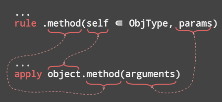

# Bee Specification: Object Oriented Model (06-objects.md)

## 1. Executive Object Model & Root Entity Philosophy

Bee employs a unified **Universal Entity Model**:
- **Root Object Hierarchy:** All values in Bee—including single-letter mathematical primitives ($\mathbb{Z}, \mathbb{N}, \mathbb{R}, \mathbb{S}$), collections (`array`, `list`, `map`, `set`), and user-defined instances—derive from the root **`Object`** (or `O`).
- **Universal `.type()` Introspection:** Every entity derives from `Object`, allowing identifier or literal expressions to be introspected without ambiguity:
  ```bee
  new x := 42;
  print x.type(); -- Prints "Z"
  
  new str := "hello";
  print str.type(); -- Prints "S"
  
  new obj := Foo(1, 2);
  print obj.type(); -- Prints "Foo"

  new v := {};      -- empty structure → Void
  print v.type();   -- Prints "Void"
  ```

**The `Void` object** (`spec/05 §1.4`) is the empty value: an object with no
properties (`void = {}`). The `{}`, `()`, and `[]` literals — when they hold no
members — are all `void` values and report the type **`Void`**:

```bee
new a := {};   expect a is Void;   -- empty object
new b := ();   expect b is Void;   -- empty list
new c := [];   expect c is Void;   -- empty array
```

`Void` is distinct from the `nil` **sentinel** (`spec/05 §1.3`): `nil` is the
singleton marking an *unset optional member*, whereas `Void` is a *type* that
can be tested with `is`. An empty anonymous object is a `Void` value; once a
member is added via attribute overlay (§2.3) it becomes an ordinary `Object`.



---

## 2. Object Definition & Constructor Rules

An Object instance is created by a constructor **`rule`** whose return result is bound to **`self`**.

$$\text{Constructor}(\text{Params}) \longrightarrow \text{Instance}(\text{self}) \in \text{Object}$$

### 2.1 Constructor Rule Anatomy
```bee
-- Object constructor definition
rule MyObject(p1 ∈ Z, p2 ∈ R) => (self ∈ MyObject):
  -- Public properties (prefixed with self.)
  new self.prop1 := p1;
  new self.prop2 := p2;
  
  -- Private encapsulation (no prefix)
  new internal_cache := 0;
  
  -- Public method definition
  rule .compute(self ∈ MyObject) => (r ∈ R):
    let r := self.prop1 + self.prop2;
  return;
return;
```

### 2.2 Anonymous JSON & Dictionary Objects
Objects are internally backed by high-performance key-value hash structures:

An empty `{}` literal is a `Void` value (§1); it is instantiated empty and may
already report type `Void`. It becomes an ordinary `Object` once a member is
added (§2.3).

```bee
-- Anonymous object instantiation via JSON literal
new obj := {name: "Cleopatra", age: 15};

-- Dynamic member property access
print obj.name;     -- Dot-notation: "Cleopatra"
print obj["age"];   -- Index-notation: 15

-- Dynamic property deallocation
zap obj["age"];
```

### 2.3 Attribute Overlay (String-Indexed Static Members)

Bee is a statically typed language, yet it implements an **Attribute Overlay**:
every object — including instances of statically-declared `type`s and anonymous
JSON literals — is backed by a runtime dictionary. The overlay layer enables any
attribute to be resolved by its **string index**, so dot-notation and
index-notation are interchangeable aliases over the same storage slot:

$$\text{instance}.\text{name} \equiv \text{instance}["\text{name}"]$$

```bee
-- statically declared type
type Citizen: {name ∈ S, age ∈ N};

new citizen := Citizen(name: "Cleopatra", age: 15);

-- dot-notation (typed, static member)
print citizen.name;     -- "Cleopatra"

-- index-notation (attribute overlay by string key)
print citizen["age"];   -- 15

-- both forms address the identical slot
expect citizen.name = citizen["name"];   -- true
expect citizen["age"] = citizen.age;     -- true
```

Because the object dictionary backing is authoritative, the overlay works in
both directions: writing `citizen["age"] := 16` is equivalent to writing
`citizen.age := 16`, and a missing key raises `E0605 UnknownMemberKey`
regardless of which notation is used. The overlay is a distinctive Bee feature,
rarely found in other statically typed languages.

### 2.4 Object Serialization (Canonical JSON-Like Rendering)

Printing a bare object identifier renders the instance as a **canonical,
ordered JSON-like string**:

```bee
new obj := {name: "Cleopatra", age: 15};
print obj;   -- {age: 15, name: "Cleopatra"}
```

The serialization is **deterministic**: member keys are emitted in ascending
alphabetical order, so two structurally equal objects always render
identically. String-valued members are wrapped in double quotes; int-valued
members are emitted unquoted. The deterministic ordering makes autonomous
	@EXPECT` output verification of printed objects reliable — the same content
	never renders differently run to run. An empty object renders as `{}`.

### 2.5 Recursive Structures, Optional References & Safe Navigation

An anonymous (or typed) object may reference **another instance of itself**,
forming a recursive structure such as a linked list or tree (spec/05 §optional
union types). A member that may hold such a reference — or the absence of one —
carries an optional type and is initialized to the **`nil`** sentinel:

```bee
type Node: {
  data ∈ Z,
  next ∈ @Node?   -- optional reference to another Node (or nil)
} <: Object;

rule main:
  -- bottom-up allocation binds symbols before assignment
  new n3 := {data: 3, next: nil};
  new n2 := {data: 2, next: n3};
  new n1 := {data: 1, next: n2};

  -- read a data member on a recursive node
  expect n1.data = 1;              -- plain member access

  -- safe navigation `?.` never panics on nil
  expect n1.next?.data = 2;        -- n1.next is n2, so .data = 2
  expect n1.next?.next?.data = 3;  -- n2.next is n3, so .data = 3
  expect n1.next?.next?.next = nil;-- n3.next is nil
return;
```

- **`T?`** declares an *optional union type*: the value is either a `T` or the
  `nil` sentinel (`T ∪ {nil}`, spec/05 §optional). An optional member left
  unset holds `nil`.
- **`nil`** is the singleton sentinel denoting the *absence of a value*. All
  `nil` writes alias the same sentinel, so `x = nil` is an identity check.
- **`?.` safe navigation** reads a member only when the base is non-`nil`; when
  the base (or any intermediate link) is `nil`, the *whole chain* evaluates to
  `nil` instead of raising `E0605`. Plain `.` dereferencing through `nil` is an
  error; `?.` is the safe form for optional references.

### 2.6 Optional Chaining Grammar

```ebnf
member_access ::= expression ( ( "." | "?." ) identifier )* [ "(" [ arg_list ] ")" ] ;
```

The `?.` token is lexed as a single **`OPTIONAL_CHAIN`** operator. Each `?.`
link short-circuits to `nil` when its base is `nil`/absent, so `a?.b?.c` is
`nil` if `a`, `a.b`, or `a.b` is `nil`.

---

## 3. Encapsulation & Member Visibility

- **Public Members (`.` Prefix):** Any property or method prefixed with `.` (e.g. `self.value`, `.log()`) is exported on the `self` instance and accessible via dot-notation (`instance.log()`).
- **Private Encapsulation (No Prefix):** Local variables declared within the constructor rule without `self.` (e.g., `new count := 0;`) are strictly private to the constructor's static closure frame.
- **Instance Reference (`self`):** The `self` reference holds the dynamic instance heap context allocated when `new` invokes the constructor.

---

## 4. Inheritance (`<:`), `super.` & Abstraction

### 4.1 Subtype Inheritance (`<:`)
Subclasses declare inheritance using `<: SuperType` and initialize base state using `super(...)` or `super.method()`:

$$\text{SubClass} <: \text{SuperClass} \implies \text{Methods}(\text{SuperClass}) \subseteq \text{Methods}(\text{SubClass})$$

```bee
-- Base type
type Foo: {a ∈ N, b ∈ N} <: Object;

rule Foo(p1, p2 ∈ N) => (self ∈ Foo):
  let self := {a: p1, b: p2};
  
  rule .log(self ∈ Foo):
    print "a = ", self.a, " b = ", self.b;
  return;
return;

-- Derived subtype
type Bar: {a ∈ N, b ∈ N, c ∈ R} <: Foo;

rule Bar(p1, p2 ∈ N, p3 ∈ R) => (self ∈ Bar):
  -- Invoke supertype constructor
  let self := super(p1, p2);
  new self.c := p3;
  
  -- Override method with super call
  rule .log(self ∈ Bar):
    apply super.log();
    print "c = ", self.c;
  return;
return;
```

### 4.2 Abstract Types & Forward Method Signatures
An abstract constructor rule contains forward-declared public method signatures without statement bodies. Derived types MUST override and supply implementations for all abstract methods:

```bee
-- Abstract interface rule
rule Shape() => (self ∈ Shape):
  rule .area(self ∈ Shape) => (a ∈ R); -- Abstract signature
return;

-- Concrete implementation
rule Circle(radius ∈ R) => (self ∈ Circle <: Shape):
  new self.r := radius;
  
  rule .area(self ∈ Circle) => (a ∈ R):
    let a := 3.14159265 * self.r ^ 2;
  return;
return;
```

---

## 5. Composition & Traits (`+`)

Traits provide reusable behavior composition (horizontal reuse):

$$\text{Class} = \text{BaseType} + \text{Trait}_1 + \text{Trait}_2$$

```bee
-- Trait rule definition
rule Printable(self ∈ Object):
  rule .print_summary(self ∈ Object):
    for k ∈ self.keys() do
      print (k, "=>", self[k]) using: " ";
    done;
  return;
return;

-- Applying trait composition
rule Item(id ∈ Z) => (self ∈ Item + Printable):
  new self.id := id;
  
  -- Augment self with trait methods
  apply Printable(self);
return;
```

---

## 6. Formal EBNF Grammar

```ebnf
(* Object Type Declarations *)
object_type       ::= "type" type_ident ":" "{" prop_list "}" "<:" super_type [ "with" "(" trait_list ")" ] ";" ;
prop_list         ::= prop_item ( "," prop_item )* ;
prop_item         ::= identifier [ ":" expression ] [ ( "∈" | "in" ) type_specifier ] ;

(* Constructors & Methods *)
constructor_def   ::= "rule" type_ident "(" [ param_list ] ")" "=>" "(" "self" [ "∈" type_specifier ] ")" ":" block "return" ";" ;
method_def        ::= "rule" "." identifier "(" [ param_list ] ")" [ "=>" "(" result_list ")" ] ":" block "return" ";" ;

(* Instantiation & Member Access *)
instantiation     ::= "new" identifier ":=" ( type_ident "(" [ arg_list ] ")" | "{" [ json_pairs ] "}" ) ;
member_access     ::= expression ( ( "." | "?." ) identifier )* [ "(" [ arg_list ] ")" ]
                    | expression "[" expression "]" ;
super_call        ::= "super" [ "." identifier ] "(" [ arg_list ] ")" ;
```

---

## 7. Diagnostic Error Codes

| Error Code | Error Condition | Description |
| :--- | :--- | :--- |
| `E0601` | `AbstractMethodUnimplemented` | Concrete class fails to supply body for inherited abstract method |
| `E0602` | `PrivatePropertyAccess` | Attempt to access property without `.` or `self.` export prefix |
| `E0603` | `SuperConstructorMissing` | Derived constructor fails to execute `super(...)` call |
| `E0604` | `CyclicInheritance` | Class hierarchy contains circular inheritance loop |
| `E0605` | `UnknownMemberKey` | Accessing dynamic key that does not exist in object dictionary |
| `E0606` | `InvalidTraitApplication` | Trait applied to incompatible target type |

---

## 8. Alignment Status

- **Issues Addressed:** Formalized Universal Entity Model (`entity.type()`), Object constructors, public/private member scoping, inheritance (`<:`), `super.`, abstract methods, traits (`+`), and dictionary keys.
- **Manifest Tracking:** Updated `manual/MANIFEST.md` to reflect completion of `spec/06-objects.md`.