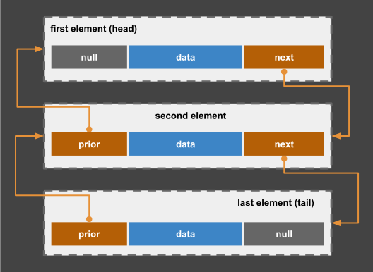
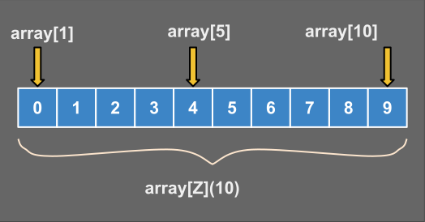
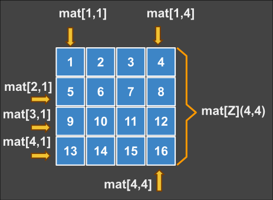
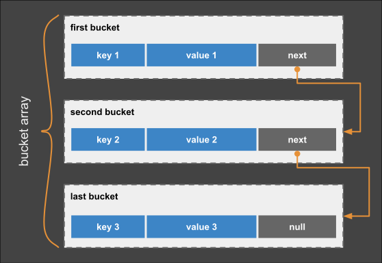

# Bee Specification: Collections & Data Structures (10-collections.md)

## 1. Executive Collection Model

Bee provides five primary collection types distinguished by syntax delimiters, mathematical characteristics, and internal memory representations:

| Collection Type | Delimiter | Mathematical Definition | Memory Structure | Indexing / Access | Mutability |
| :--- | :--- | :--- | :--- | :--- | :--- |
| **List** | `( ... )` | Ordered sequence $\langle a_1, a_2, \dots, a_n \rangle$ | Doubly-Linked Chain | 1-Based $L[i]$ | Dynamic Append / Remove |
| **Array** | `[ ... ]` | Fixed tuple $(a_1, a_2, \dots, a_n) \in \mathbb{T}^n$ | Contiguous Memory Block | 1-Based $A[i]$ | Fixed / Size Bound |
| **Matrix** | `[ ... ](r, c)` | 2D Tensor $\mathbf{M} \in \mathbb{T}^{r \times c}$ | Row-Major 2D Block | 1-Based 2D $M[r, c]$ | In-Place Element Updates |
| **Set** | `{ ... }` | Mathematical set $\{x \mid x \in \mathbb{U}\}$ | Hash / Red-Black Tree | Unique Membership $\in$ | Set Algebra ($\cap, \cup, \setminus$) |
| **Map** | `{ k: v }` | Finite Map $f: \mathbb{K} \to \mathbb{V}$ | Hash Map Dictionary | Key Indexing $M[k]$ | Dynamic Key-Value Pairs |
| **Ordinal** | `(start){ ... }` | Enumerated set $E = \{e_1, e_2, \dots\}$ | Integer Enum Slice | Dot Access `.id` | Constant Enum Set |

---

## 2. Indexing Conventions & The `$` Anchor

### 2.1 Mandatory 1-Based Indexing
All indexed collections in Bee (Lists, Arrays, Matrices, Strings, Slices) enforce **1-based indexing**:

$$\text{Domain}(L) = \{ i \in \mathbb{N} \mid 1 \le i \le |L| \}$$

Accessing index `0` triggers a compile-time or runtime error `E1006: ZeroBasedIndexAttempt`.

### 2.2 The Dynamic End Anchor (`$`)
The `$` token represents the dynamic length of the collection ($|L|$):

$$\$[L] = |L|, \quad \$[-k] = |L| - k$$

```bee
new list := (10, 20, 30, 40);

print list[1];     -- First element: 10
print list[$];     -- Last element: 40
print list[$ - 1]; -- Second-to-last element: 30
```

### 2.3 Slicing Syntax — Views, Not Copies
A slice expression `collection[a..b]` creates a **view** (a reference window) into the original collection, not an extraction. No elements are copied; the slice aliases the source storage, so mutations through the view are visible in the original collection and vice versa:
```bee
new list  := (10, 20, 30, 40);
new slice := list[2..$ - 1]; -- view of elements 2..3: <20, 30>

let slice[1] := 99;          -- writes through the view
print list[2];               -- 99 (original collection is affected)
```

### 2.4 Reference Assignment vs. Clone Assignment `::`
Assigning a collection (or slice) with `:=` binds a **reference**; both names share the same storage:
```bee
new alias := list;           -- reference: alias and list share elements
```
To obtain an independent collection, use the clone-assignment operator `::` (see `spec/00-memory-model.md` §4), which performs a **deep copy** at binding time:
```bee
new clone :: list;           -- deep copy: clone is independent
new frozen :: list[2..3];    -- materialize a view into a real sub-collection
let clone[1] := 0;           -- does not affect list
```
`::` is a binding operator (parallel to `:=`), not a prefix expression; it appears where `:=` would appear in `new` and `let` statements.

---

## 3. Detailed Collection Specifications

### 3.1 Lists `(...)` & Dynamic Growth


- **Dynamic List Declaration:**
  ```bee
  new L ∈ List(Z) := (10, 20, 30);
  let append(L, 40);
  ```

### 3.2 Arrays `[...]` & Fixed Buffers


- **Fixed Array Declaration:**
  ```bee
  new A ∈ [Z](5) := [0, 1, 2, 3, 4];
  ```

### 3.3 Tensors `[...](d1, d2, ..., dn)`

A **tensor** is an extended matrix with N dimensions (`N ≥ 2`). A matrix is a
2-dimensional tensor; a 3-value dimension list shapes a 3D cube and a 4-value
list a 4D block. Elements are stored in row-major order (first dimension varies
slowest) and are indexed with one 1-based coordinate per dimension. A matrix is
therefore the special case `N = 2`.

$$\mathbf{M} = \begin{bmatrix} m_{1,1} & m_{1,2} & m_{1,3} \\ m_{2,1} & m_{2,2} & m_{2,3} \end{bmatrix}$$



**Declaration & cell access (2D matrix):**
```bee
new M ∈ [Z](2, 3) := [[1, 2, 3], [4, 5, 6]];
let M[1, 2] := 100; -- Row 1, Column 2 updated to 100
```

**3D cube and 4D block (N ≥ 3):**
```bee
new cube ∈ [Z](4, 4, 4);     -- 4×4×4 = 64 cells
let cube[2, 3, 2] := 26;

new block ∈ [Z](2, 2, 2, 2); -- 2×2×2×2 = 16 cells
let block[2, 2, 2, 2] := 22;
```

A single-integer form `[Z](n)` is a fixed-size array (see §3.2), not a tensor.

### 3.4 Set Algebra Operators
Sets are unordered collections of unique elements supporting native mathematical set algebra:

$$\begin{aligned}
S_1 \cap S_2 &= \{ x \mid x \in S_1 \wedge x \in S_2 \} \\
S_1 \cup S_2 &= \{ x \mid x \in S_1 \vee x \in S_2 \} \\
S_1 \setminus S_2 &= \{ x \mid x \in S_1 \wedge x \notin S_2 \} \\
S_1 \Delta S_2 &= (S_1 \cup S_2) \setminus (S_1 \cap S_2)
\end{aligned}$$

| Operation | Operator Symbol | Example Expression | Description |
| :--- | :--- | :--- | :--- |
| **Intersection** | `∩` | `s1 ∩ s2` | Elements present in both `s1` and `s2` |
| **Union** | `∪` | `s1 ∪ s2` | Combined unique elements of `s1` and `s2` |
| **Difference** | `\` | `s1 \ s2` | Elements in `s1` not present in `s2` |
| **Sym Difference** | `Δ` | `s1 Δ s2` | Elements in `s1` or `s2` but not both |
| **Summation** | `Σ` | `Σ collection` | Sum of all members in a collection |
| **Subset Test** | `⊂` | `s1 ⊂ s2` | Evaluates to `true` if `s1` is strict subset |
| **Superset Test** | `⊃` | `s1 ⊃ s2` | Evaluates to `true` if `s1` is strict superset |

```bee
new s1 := {1, 2, 3};
new s2 := {3, 4, 5};

new common := s1 ∩ s2; -- {3}
new total := s1 ∪ s2;  -- {1, 2, 3, 4, 5}
```

### 3.5 Hash Maps `{:}`


Key-value dictionaries associate unique keys with values:
```bee
new userMap ∈ {S: Z} := {"alice": 100, "bob": 200};

let userMap["charlie"] := 300; -- Insert new key
cut userMap["alice"];          -- Remove key (element removal)
zap oldRef;                    -- Invalidate a reference (memory directive, §2.3)
```

**Element Removal (`cut`):** `cut target[index];` removes the element at the
given 1-based index from a list/array (shifting remaining elements) or the key
from a map. `cut` is the canonical collection element-removal keyword;
`zap` remains the memory-directive keyword for invalidating identifiers.

---

## 4. Formal EBNF Grammar

```ebnf
(* Collection Literals *)
collection_lit    ::= list_lit | array_lit | matrix_lit | set_lit | map_lit | ordinal_lit ;

list_lit          ::= "(" expression ( "," expression )* ")" ;
array_lit         ::= "[" expression ( "," expression )* "]" ;
matrix_lit        ::= "[" array_lit ( "," array_lit )* "]" ;
set_lit           ::= "{" expression ( "," expression )* "}" ;
map_lit           ::= "{" key_value_pair ( "," key_value_pair )* "}" ;
key_value_pair    ::= expression ":" expression ;
ordinal_lit       ::= "(" integer_lit ")" "{" identifier ( "," identifier )* "}" ;

(* Indexing & Set Algebra *)
indexing          ::= expression "[" index_expr ( "," index_expr )* "]" ;
index_expr        ::= expression | "$" | range_expr ;

set_algebra_op    ::= "∩" | "∪" | "\\" | "Δ" | "⊂" | "⊃" | "∈" | "!∈" ;
set_expr          ::= expression set_algebra_op expression ;

(* Element Removal *)
cut_stmt          ::= "cut" expression "[" index_expr "]" ";" ;
```

---

## 5. Diagnostic Error Codes

| Error Code | Error Condition | Description |
| :--- | :--- | :--- |
| `E1001` | `IndexOutOfBounds` | Index is less than 1 or exceeds collection length `$` |
| `E1002` | `DuplicateSetKey` | Attempt to insert duplicate key/element into Set/Map |
| `E1003` | `MatrixDimensionMismatch` | Incompatible row/column dimension during assignment |
| `E1004` | `TypeIncompatibleCollection` | Value type does not match declared collection element type |
| `E1005` | `InvalidSetAlgebra` | Set operator (`∩`, `∪`) applied to non-set types |
| `E1006` | `ZeroBasedIndexAttempt` | Attempting to use index 0 in Bee 1-based indexing |

---

## 6. Alignment Status

- **Issues Addressed:** Formalized collection syntax, 1-based indexing invariants, and set algebra semantics.
- **Manifest Tracking:** Updated `manual/MANIFEST.md` to reflect completion of `spec/10-collections.md`.
