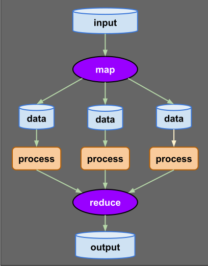

# Bee Specification: Data Processing & Transformation (11-processing.md)

## 1. Executive Processing Model

Bee provides native mathematical primitives for complex data manipulation, pipeline processing, pointer-free boxing, and parallel collection transformation:

1. **Explicit Primitive Boxing (`[x]`):** Wraps stack primitives into mutable heap reference cells without pointer arithmetic.
2. **Mathematical Quantifiers ($\forall, \exists$):** Language-level universal and existential quantifiers for iterations and boolean constraints.
3. **Data Pipelines (`>>`) & Map-Reduce:** Expressive, composable streaming transformations over collections.
4. **Deconstruction & Spread (`*`):** Tuple/collection unpacking into named variables.
5. **Matrix Slice Mutation:** Operations targeting entire rows or columns ($M[1, *]$).



---

## 2. Value Boxing & Unboxing Semantics

### 2.1 Primitive Boxing (`[x]`)
Primitives in Bee ($\mathbb{Z}, \mathbb{R}, \mathbb{B}$) reside on the stack by default. Enclosing a value or variable in square brackets `[value]` allocates a heap-managed mutable reference cell typed as `[Type]`:

$$\text{Box}(v) \in \text{Heap}[\mathbb{T}]$$

```bee
-- Declare boxed integer variable
new boxed_int ∈ [Z];

-- Explicit boxing: wraps primitive n into a heap reference cell
let boxed_int := [42];

-- Shared reference assignment vs deep clone
new alias_ref := boxed_int;   -- Shared reference (aliasing)
new cloned_ref :: boxed_int;  -- Deep copy (independent heap slot)
```

### 2.2 Explicit Unboxing (`Type(boxed)`)
Unboxing extracts the raw scalar value from a heap reference box:
```bee
new raw_val ∈ Z;
let raw_val := Z(boxed_int); -- Extract integer scalar
```

---

## 3. Quantifier Expressions ($\forall, \exists$)

Bee integrates formal mathematical predicate logic directly into language expressions and iteration blocks.

### 3.1 Universal Quantifier ($\forall$ / `forall`)
$$\forall x \in S, \quad P(x) \in \{0, 1\}$$

- **Iteration Clause:** Iterates through every element in a collection or range:
  ```bee
  for ∀ item ∈ collection do
    apply process(item);
  repeat;
  ```
- **Predicate Evaluation:** Returns `true` if every element satisfies the condition:
  ```bee
  new all_positive := (∀ x ∈ numbers : x > 0);
  ```

### 3.2 Existential Quantifier ($\exists$ / `exists`)
$$\exists x \in S \quad \text{s.t.} \quad P(x) = 1$$

- **Predicate Evaluation:** Returns `true` if at least one element satisfies the condition:
  ```bee
  new has_zero := (∃ x ∈ numbers : x = 0);
  ```

---

## 4. Pipeline Processing (`>>`) & Map-Reduce

Data transformations can be chained using the pipe operator **`>>`** or invoked via collection methods:

$$\text{Pipeline}: \quad \text{Input} \xrightarrow{f_1} T_1 \xrightarrow{f_2} T_2 \dots \xrightarrow{f_k} \text{Output}$$

### 4.1 Chained Pipeline Syntax (`>>`)
```bee
new data := [1, 2, 3, 4, 5, 6, 7, 8, 9, 10];

-- Filter even numbers, square them, and sum the result
new result := data >> filter(λ(x) => x % 2 = 0)
                   >> map(λ(x) => x ^ 2)
                   >> sum();
```

### 4.2 Map-Reduce Operations
- **`.map(λ)`:** Transforms every element into a new representation.
- **`.filter(λ)`:** Retains elements matching the boolean predicate lambda.
- **`.reduce(init, λ)`:** Folds elements into a single aggregate result using an accumulator lambda.
- **Built-in Aggregates:** `.count()`, `.sum()`, `.avg()`, `.min()`, `.max()`.

---

## 5. Deconstruction, Spreading (`*`) & Matrix Slicing

### 5.1 Variable Deconstruction & Spread (`*`)
$$(x, y, \dots, \text{tail}) \leftarrow \text{Collection}$$

```bee
new list := [10, 20, 30, 40, 50];

-- Unpack head elements and gather remaining tail items
new x, y, *tail := list;
-- x = 10, y = 20, tail = [30, 40, 50]
```

### 5.2 Matrix Row / Column Slice Mutation
Wildcard `*` in matrix indices selects an entire row or column for bulk mutation:
```bee
new M ∈ [Z](3, 3) := [[1, 2, 3], [4, 5, 6], [7, 8, 9]];

-- Mutate entire Row 1 to 0
let M[1, *] := 0; -- Row 1 becomes [0, 0, 0]

-- Mutate entire Column 2 to 100
let M[*, 2] := 100; -- Column 2 becomes [100, 100, 100]
```

---

## 6. Formal EBNF Grammar

```ebnf
(* Boxing & Copying *)
boxed_expr        ::= "[" expression "]" ;
unboxed_expr      ::= primitive_type "(" expression ")" ;
deep_clone        ::= identifier "::" expression ;

(* Quantifiers *)
quantifier_expr   ::= "(" ( "∀" | "forall" | "∃" | "exists" ) identifier ( "∈" | "in" ) expression ":" condition ")" ;

(* Pipelines & Map-Reduce *)
pipeline_expr     ::= expression ">>" transform_step ( ">>" transform_step )* ;
transform_step    ::= identifier "(" [ arg_list ] ")" | lambda_expr ;

(* Deconstruction & Matrix Slicing *)
deconstruct_stmt  ::= "new" identifier_list [ "," "*" identifier ] ":=" expression ";" ;
matrix_slice      ::= identifier "[" ( expression | "*" ) "," ( expression | "*" ) "]" ;
```

---

## 7. Diagnostic Error Codes

| Error Code | Error Condition | Description |
| :--- | :--- | :--- |
| `E1101` | `UnboxingTypeMismatch` | Attempting to unbox a reference into an incompatible scalar type |
| `E1102` | `InvalidQuantifierDomain` | Quantifier applied to a non-collection operand |
| `E1103` | `PipelineStepIncompatible` | Output type of pipeline step does not match input of next step |
| `E1104` | `DeconstructionMismatch` | Number of targets exceeds collection elements without `*` tail |
| `E1105` | `InvalidMatrixSlice` | Dimension wildcard `*` used on non-matrix or invalid rank |
| `E1106` | `NonBoxedAssignment` | Attempting reference assignment `:=` on unboxed value |

---

## 8. Alignment Status

- **Issues Addressed:** Formalized primitive boxing `[x]`, unboxing `Type(boxed)`, quantifiers (`∀`, `∃`), pipelines (`>>`), map-reduce, deconstruction (`*`), matrix row/column slicing (`M[1, *]`), deep clone (`::`), and diagnostic codes.
- **Manifest Tracking:** Updated `MANIFEST.md` to reflect completion of `spec/11-processing.md`.
