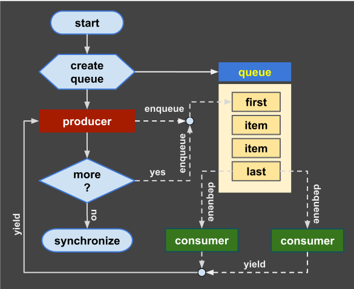

# Bee Specification: Concurrency & Parallel Orchestration (12-concurrency.md)

## 1. Executive Concurrency Architecture

Bee provides a high-performance, race-free concurrency model combining **Region Arena Memory Isolation**, **Thread-Safe Reduction Queues**, **Barrier Synchronization**, and **Cooperative Coroutines**:

1. **Thread Spawning (`begin`):** Spawns an asynchronous worker thread operating within a private, isolated Region Arena.
2. **Synchronization Barriers (`wait`):** Blocks parent thread execution until all active worker threads in the current scope frame complete.
3. **Thread-Safe Reduction (`+>`):** Concurrently appends or reduces worker thread return values into shared parent collections via a lock-free channel queue.
4. **Cooperative Coroutines (`yield`):** Suspends execution of a stateful task and yields control back to the consumer thread.



---

## 2. Multithreaded Execution (`begin` / `wait`)

$$\text{Parent Thread} \xrightarrow{\text{begin}} \{ \mathcal{T}_1, \mathcal{T}_2, \dots, \mathcal{T}_k \} \xrightarrow{\text{wait}} \text{Synchronized Parent}$$

### 2.1 Asynchronous Thread Creation
When `begin` is invoked, the runtime creates a lightweight thread context with an isolated Region Arena stack/heap:
```bee
-- Asynchronous rule execution
rule main:
  for ∀ i ∈ (1..4) do
    begin worker_task(i); -- Spawns 4 concurrent worker threads
  repeat;
  
  wait; -- Mandatory synchronization barrier
return;
```

### 2.2 Unsynchronized Worker Protection
If a scope exits with active worker threads spawned by `begin` before a `wait` barrier is encountered, the compiler raises a compile-time error `E1201: UnsynchronizedWorker`.

---

## 3. Thread-Safe Reduction & Append (`+>`)

Passing a shared collection into a worker thread using the reduction append operator **`+>`** directs the worker's output into a lock-free, atomic queue:

$$\mathcal{T}_i \xrightarrow{\text{return}} \text{AtomicQueue} \xrightarrow{\text{wait}} \text{TargetCollection}$$

```bee
rule sum_range(a, b ∈ Z) => (r ∈ Z):
  for i ∈ (a..b) do
    let r += i;
  repeat;
return;

rule main:
  new parts ∈ List(Z);
  
  -- Parallel map-reduce dispatching 3 worker tasks
  begin sum_range(1, 25) +> parts;
  begin sum_range(26, 50) +> parts;
  begin sum_range(51, 75) +> parts;
  
  wait; -- Synchronizes threads and flushes reduction queue into parts
  
  new total ∈ Z := 0;
  for ∀ p ∈ parts do
    let total += p;
  repeat;
  print total;
return;
```

---

## 4. Cooperative Coroutines & Yield Channels (`yield`)

Coroutines allow stateful tasks to suspend execution, returning control and values to consumer threads.

### 4.1 Suspended Generator (`yield`)
A rule containing `yield` acts as a stateful coroutine generator. Reaching `yield` freezes the coroutine's local frame:
```bee
rule ticker(n ∈ N) => (v ∈ N):
  for i ∈ (1..n) do
    let v := i;
    yield; -- Suspends execution and yields control
  repeat;
  let v := 0;
return;
```

### 4.2 Consumer Channel Extraction (`yield var << coroutine`)
The consumer thread extracts yielded values from an active coroutine using the `yield var << coroutine` channel operator:
```bee
rule main:
  new r ∈ N := 1;
  begin ticker(4); -- Instantiates coroutine task
  
  while r > 0 do
    yield r << ticker; -- Extracts next yielded value from ticker
    write (r, " ");
  repeat;
  print;
  wait;
return;
```

---

## 5. Worker Exception Isolation & Error Propagation

- **Isolated Error State:** Uncaught exceptions or panics within a worker thread do not corrupt parent or sibling memory arenas. The failure is captured inside the worker's thread-local `$trial` handle.
- **Barrier Re-Raising:** When the parent thread executes `wait;`, any captured worker exceptions are aggregated and re-raised at the `wait` barrier call site for handling in a parent `trial` block.

---

## 6. Formal EBNF Grammar

```ebnf
(* Thread Spawning & Barrier *)
async_spawn       ::= "begin" rule_call [ "+>" target_collection ] ";" ;
sync_barrier      ::= "wait" ";" ;

(* Coroutines & Channels *)
yield_stmt        ::= "yield" ";" ;
channel_extract   ::= "yield" identifier "<<" identifier ";" ;

(* Collection Reduction *)
target_collection ::= identifier | expression ;
```

---

## 7. Diagnostic Error Codes

| Error Code | Error Condition | Description |
| :--- | :--- | :--- |
| `E1201` | `UnsynchronizedWorker` | Scope exited with pending `begin` threads prior to `wait` barrier |
| `E1202` | `DataRaceAttempt` | Direct cross-thread mutation without `+>` reduction channel |
| `E1203` | `CoroutinesChannelClosed` | Attempting `yield var << task` on a closed or finished coroutine |
| `E1204` | `WorkerPanicReRaised` | Unhandled exception in worker thread surfaced at `wait` barrier |
| `E1205` | `YieldOutsideCoroutine` | Using `yield` inside a non-coroutine static rule |

---

## 8. Alignment Status

- **Issues Addressed:** Formalized multithreading (`begin`/`wait`), thread-safe reduction (`+>`), coroutines (`yield`), channel extraction (`<<`), worker exception isolation, and diagnostic codes.
- **Manifest Tracking:** Updated `MANIFEST.md` to reflect completion of `spec/12-concurrency.md`.
